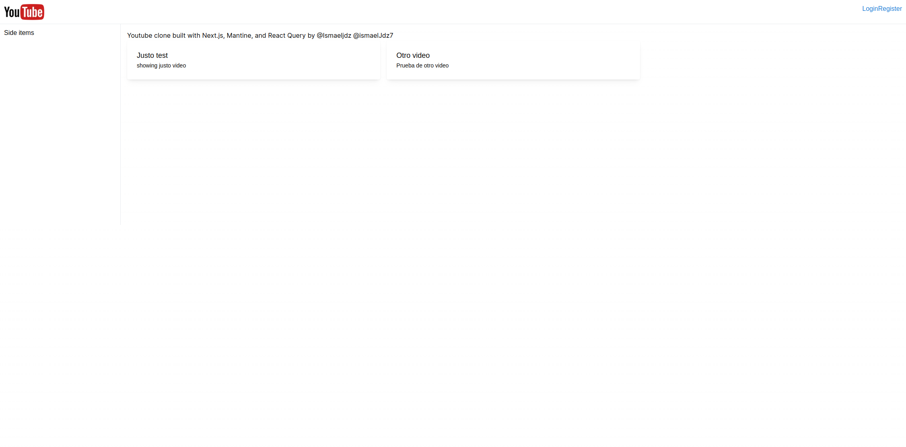

# Build a Youtube clone with Express, MongoDB, & TypeScript

## Features

1. Register user
2. Login
3. Get current logged in user (me)
4. Upload video
5. Get all videos
6. Stream a video

## Technologies

### Backend

- [Express](https://expressjs.com/)
- [Mongoose](https://www.mongodb.com/)
- [TypeScript](https://www.typescriptlang.org/)
- [argon2](https://www.npmjs.com/package/argon2)
- [busboy](https://www.npmjs.com/package/busboy)
- [pino](https://github.com/pinojs/pino)
- [Zod](https://github.com/colinhacks/zod)

### Frontend

- [Next.js](https://nextjs.org/)
- [Mantine](https://mantine.dev/)
- [TypeScript](https://www.typescriptlang.org/)
- [React Query](https://react-query.tanstack.com/)

## What you'll need

1. Code editor - VSCode
2. Postman/ insomnia
3. Browser - Chrome
4. Running instance of MongoDB
5. Node.js

## What you will learn

1. REST API principals
2. Some auth principals
3. MongoDB with Mongoose
4. Graceful shutdowns
5. File upload streams with Node.js
6. Video streaming with Node.js
7. Next.js
8. Mantine
9. React.js context API
10. Express & React.js with TypeScript
11. Clean project structure

## Video structure

1. Demonstration
2. Code walk-through
3. Bootstrap server
   - Initialise application
   - Setup express
   - Setup logger
   - Setup Mongoose
4. User
   - Register user
   - Login
   - Require user and deserialize user middleware
   - Get current user
5. Video
   - Upload video
   - Update video
   - Get all videos
   - Stream video
6. Setup client
7. Auth
   - Login screen
   - Register screen
8. Video
   - Upload video
   - Stream video
